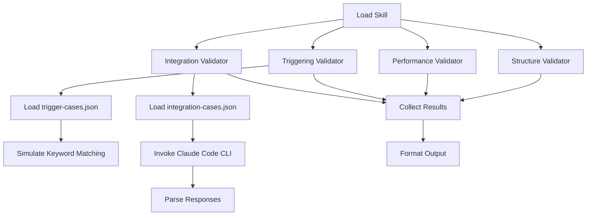

# Validation Order & Architecture

## Overview

skill-lint performs validations through four independent validators that can run sequentially or in parallel. This document explains the validation order, dependencies, and execution model.

## Validator Types

### 1. Structure Validator
**Purpose**: Validates skill file structure, metadata, and project scaffolding  
**Execution Time**: ~5-20ms (sequential checks within validator are now parallelized)  
**Dependencies**: None — can run independently

**Checks Performed** (in parallel groups):
- **Group 1: File Existence**
  - SKILL.md existence and readability
  - Frontmatter quality (synchronous, no network I/O)
  - Section structure (synchronous, no network I/O)

- **Group 2: Project Files** (parallel execution)
  - plugin.json structure and validity
  - Broken links detection
  - README.md existence and content
  - Test fixtures (trigger-cases.json)
  - package.json and test script

**Output**: Structural violations (errors, warnings, info)

---

### 2. Performance Validator
**Purpose**: Checks file sizes, token budgets, and context efficiency  
**Execution Time**: ~10-30ms (checks now parallelized)  
**Dependencies**: None — can run independently

**Checks Performed** (in parallel groups):
- **Group 1: Synchronous Checks**
  - SKILL.md line count (from already-loaded content)
  - Token budget estimation
  - Context budget calculation

- **Group 2: File I/O Checks** (parallel execution)
  - Reference files detection
  - README.md conciseness
  - Duplicate content between README and SKILL
  - Fixture file size (trigger-cases.json)

**Output**: Performance violations and metrics

---

### 3. Triggering Validator
**Purpose**: Validates triggering patterns and keyword matching accuracy  
**Execution Time**: ~5-15ms (keyword matching simulation)  
**Dependencies**: 
- Requires `test/fixtures/trigger-cases.json` (optional — skips if missing)
- Requires skill metadata with trigger keywords (loaded from SKILL.md frontmatter)

**Checks Performed** (sequential — keyword matching is lightweight):
1. Load test cases from trigger-cases.json
2. Extract skill configuration (trigger keywords, anti-keywords, detection patterns)
3. Simulate keyword matching for each test case
4. Calculate accuracy metrics (overall, positive, negative)
5. Report failed cases and accuracy warnings

**Output**: Triggering violations and accuracy metrics

**Note**: This is a **simulation** using keyword matching and does NOT represent how Claude actually decides which skill to invoke. Claude uses semantic understanding, not regex or keyword patterns.

---

### 4. Integration Validator
**Purpose**: Tests real skill execution with Claude Code adapter  
**Execution Time**: ~30-120 seconds (depending on test cases and API latency)  
**Dependencies**:
- Requires Claude Code CLI (`claude-code` command)
- Requires `test/fixtures/integration-cases.json` (optional)
- Network connectivity (API calls)
- Rate limiting considerations

**Checks Performed** (sequential — API calls cannot be parallelized safely):
1. Load integration test cases
2. For each test case:
   - Invoke Claude Code with test prompt
   - Parse response to detect invoked skill
   - Compare against expected skill
3. Calculate accuracy metrics
4. Report failures and accuracy warnings

**Output**: Integration violations and accuracy metrics

**Note**: Integration tests are **expensive** (time + API costs). Use sparingly during development. Reserve for CI/CD and pre-release validation.

---

## Execution Models

### Sequential Execution (Default)
**Config**: `execution.parallel: false`

Validators run one after another:
```
Structure → Performance → Triggering → Integration
   ~10ms       ~20ms          ~10ms        ~60s
```

**Advantages**:
- Predictable execution order
- Easier debugging (errors happen in order)
- Lower memory footprint

**Disadvantages**:
- Slower total execution time
- Integration validator blocks everything

**When to Use**:
- Development and debugging
- When validators have side effects
- When running integration tests (to avoid rate limiting)

---

### Parallel Execution (Opt-in)
**Config**: `execution.parallel: true`

Validators run simultaneously:
```
Structure  ┐
Performance├─→ Collect Results
Triggering │
Integration┘

Total time ≈ max(Structure, Performance, Triggering, Integration) ≈ 60s
```

**Advantages**:
- **Much faster** when integration tests are involved
- Better resource utilization
- Independent validators don't block each other

**Disadvantages**:
- Higher memory usage (all validators active)
- Harder to debug (errors happen concurrently)
- Potential rate limiting issues if integration makes many API calls

**When to Use**:
- CI/CD pipelines (time-sensitive)
- Bulk linting (many skills)
- When structure/performance/triggering need results quickly

---

## Internal Parallelization (New in Sprint 3)

Even within individual validators, **independent file I/O operations** are now parallelized using `Promise.all()`:

### Structure Validator Parallelization
```typescript
// OLD (Sequential):
await checkPluginJson();
await checkLinks();
await checkReadme();
await checkTestFixtures();
await checkProjectFiles();

// NEW (Parallel):
const [plugin, links, readme, fixtures, project] = await Promise.all([
  checkPluginJson(),
  checkLinks(),
  checkReadme(),
  checkTestFixtures(),
  checkProjectFiles(),
]);
```

**Speed Improvement**: 3-5x faster for structure validation

---

### Performance Validator Parallelization
```typescript
// OLD (Sequential):
await checkReferenceFiles();
await checkReadmeConciseness();
await checkDuplicateContent();
await checkFixtureSize();

// NEW (Parallel):
const [refs, readme, duplicates, fixtures] = await Promise.all([
  checkReferenceFiles(),
  checkReadmeConciseness(),
  checkDuplicateContent(),
  checkFixtureSize(),
]);
```

**Speed Improvement**: 2-3x faster for performance validation

---

## Dependency Graph



**Key Points**:
- Validators have **no dependencies** on each other
- All validators depend on `Load Skill` (SKILL.md content + metadata)
- Triggering and Integration validators **optionally** depend on test fixture files
- Results are collected and formatted after all validators complete

---

## Error Handling & Resilience

### Validator Crash Protection
Each validator runs in an **error boundary**. If a validator crashes:
1. The crash is caught and logged
2. A `validator-crash` violation is created
3. Other validators continue executing
4. Overall lint result is marked as `failed: true`

**Example**:
```typescript
try {
  result = await validator.validate(skill, config);
} catch (error) {
  result = {
    validator: validator.name,
    passed: false,
    violations: [{
      level: 'error',
      rule: 'validator-crash',
      message: `Validator "${validator.name}" crashed: ${error.message}`,
    }],
  };
}
```

**Benefit**: One broken validator doesn't bring down the entire tool.

---

### File I/O Resilience
All file operations use **exponential backoff retry** (Sprint 2 - CR-005):
- Retries on transient errors: `EMFILE`, `EBUSY`, `EACCES`, `EAGAIN`, `ENFILE`, `EPERM`
- Fails fast on permanent errors: `ENOENT`, `EISDIR`
- Exponential delay: 100ms → 200ms → 400ms (max 3 retries)
- Jitter (0-50%) to prevent thundering herd

**Benefit**: Robust against temporary file system contention in CI/CD environments.

---

### Large File Safety
Files >10MB are processed using **streaming** (Sprint 2 - CR-006):
- Prevents OOM errors on large files
- Uses Node.js `readline` + `createReadStream`
- Automatically switches based on file size
- No configuration required

**Benefit**: Can lint projects with large README or reference files without crashing.

---

## Performance Characteristics

### Validator Performance (Typical)
| Validator    | Sequential | Parallel (Internal) | Network | Disk I/O |
|--------------|------------|---------------------|---------|----------|
| Structure    | 15-20ms    | 5-10ms              | ❌      | ✅       |
| Performance  | 20-30ms    | 10-15ms             | ❌      | ✅       |
| Triggering   | 5-15ms     | 5-15ms              | ❌      | ✅ (minimal) |
| Integration  | 30-120s    | 30-120s             | ✅      | ✅       |

**Key Insight**: Structure and Performance validators benefit significantly from internal parallelization. Integration validator is network-bound and cannot be further optimized.

---

### Parallelization Impact
| Scenario                          | Sequential | Parallel | Speedup |
|-----------------------------------|------------|----------|---------|
| Structure + Performance only      | ~40ms      | ~15ms    | 2.7x    |
| Structure + Performance + Trigger | ~55ms      | ~20ms    | 2.8x    |
| All validators (with integration) | ~120s      | ~120s    | 1.0x    |

**Conclusion**: Parallel execution helps for fast validators. Integration tests dominate total time regardless of parallelization.

---

## Configuration Best Practices

### Development
```json
{
  "scenarios": {
    "structure": true,
    "performance": true,
    "triggering": true,
    "integration": false  // Skip expensive integration tests
  },
  "execution": {
    "parallel": false,  // Sequential for easier debugging
    "timeout": 60000
  }
}
```

---

### CI/CD
```json
{
  "scenarios": {
    "structure": true,
    "performance": true,
    "triggering": true,
    "integration": true  // Full validation before release
  },
  "execution": {
    "parallel": true,  // Faster execution
    "timeout": 120000,
    "maxRetries": 3
  }
}
```

---

### Bulk Linting (Many Skills)
```json
{
  "scenarios": {
    "structure": true,
    "performance": true,
    "triggering": true,
    "integration": false  // Too expensive for bulk
  },
  "execution": {
    "parallel": true  // Process skills faster
  }
}
```

---

## Future Improvements

### Potential Optimizations
1. **Validator-level caching**: Cache parsed skill files and test fixtures
2. **Incremental validation**: Only re-validate changed validators
3. **Distributed execution**: Run validators across multiple processes/workers
4. **Integration test batching**: Group integration tests to reduce API calls

### Monitoring Additions
1. **Performance profiling**: Track validator execution time per run
2. **Bottleneck detection**: Identify slow file operations
3. **Memory profiling**: Track memory usage during validation

---

## See Also

- [Architecture Documentation](./README.md)
- [Performance Optimization (Sprint 3 - PERF-001)](../BACKLOG.md#perf-001)
- [Error Message Catalog (Sprint 3 - CR-007)](../src/utils/error-messages.ts)
- [Structured Logging (Sprint 3 - CR-010)](../src/utils/structured-logger.ts)
